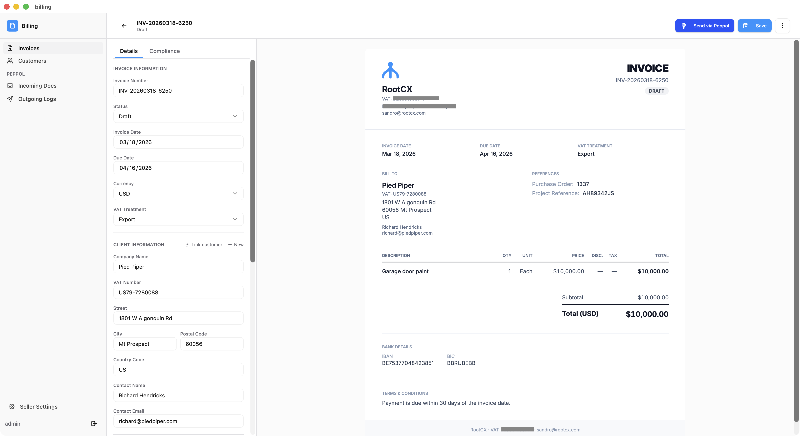

# Billing

Open-source invoicing application built with [RootCX](https://github.com/RootCX/RootCX), a platform for building enterprise-grade business apps with built-in governance, audit trails, and access control.



## What is this?

Billing is a full-featured invoicing app that runs as a native desktop application (via Tauri). It includes:

- **Invoice management**:create, edit, and track invoices with real-time preview
- **Customer & contact management**:manage clients with multiple contacts per customer
- **Peppol e-invoicing**:send and receive invoices via the Peppol network
- **Print / PDF export**:generate print-ready invoices
- **VAT handling**:support for multiple VAT treatments (domestic, intra-community, export, reverse charge)
- **Enterprise governance**:all data operations go through RootCX, ensuring role-based access control, full audit history, and multi-user collaboration out of the box

## Malleable software

This app is designed to be forked, adapted, and made your own. The entire source code is here:use it as-is for your invoicing needs, or take it as a starting point and reshape it to fit your business. Add fields, change workflows, plug in your own integrations. That's the point of malleable software: you own it, you shape it.
## Getting started

### Prerequisites

- [Node.js](https://nodejs.org/) (v18+)
- [Rust](https://www.rust-lang.org/tools/install) (for Tauri)
- A running [RootCX](https://github.com/RootCX/RootCX) instance

### Install and run

```bash
npm install
npm run tauri dev
```

## License

[Apache 2.0](LICENSE)
